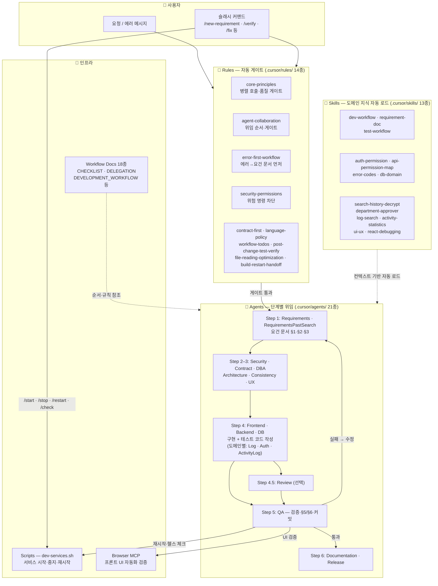

# 로그 관리 (logmng) — 개발 워크스페이스

로그 검색, 활동 이력, 통계, 승인·사용자 관리 등을 제공하는 프론트엔드·백엔드 프로젝트입니다.  
이 폴더(`dev`)는 **개발 전용 워크스페이스**이며, Cursor 규칙·커맨드·서브에이전트가 여기서 동작합니다.

---

## 📂 구조

```
dev/
├── frontend/          # React (포트 3001)
├── backend/           # Spring Boot (포트 9200)
├── docs/              # 개발 관련 문서만 (요건·계약·워크플로우·템플릿)
│   ├── contract.md    # API·DB·포트 계약
│   ├── QUICK_START.md # 빠른 시작
│   ├── workflow/      # 워크플로우·위임 표(실행 시 참조)
│   ├── template/      # 요건·버그픽스 템플릿
│   ├── requirements/  # 요건 문서 (yyyyMMdd-이름.md)
│   └── design/        # UX 설계 표준
├── scripts/           # 서비스 기동/중지 (dev-services.sh)
└── .cursor/           # 규칙·커맨드·스킬·에이전트
    └── delegation-mgmt/   # 서브에이전트 개선·위임 관리 문서(개발 문서와 분리)
```

---

## ⚙️ 초기 환경 구성 (최초 1회)

Cursor에서 **브라우저 자동화 검증**(`/verify` 시 프론트 변경 TC 실행)을 쓰려면 아래를 설정하세요.

### 1. Cursor Settings에서 Browser automation 활성화

- **Cursor** → **Settings** → **Features** (또는 **MCP**)에서 **Browser automation** 사용 설정을 켭니다.
- MCP 서버 목록에 브라우저 관련 서버가 켜져 있는지 확인하세요.

### 2. Puppeteer MCP — `.cursor/mcp.json` 활성화

프로젝트에 이미 `.cursor/mcp.json`이 있으며, Puppeteer MCP 서버가 정의되어 있습니다.

```json
{"mcpServers":{"browser":{"command":"npx","args":["-y","@modelcontextprotocol/server-puppeteer"]}}}
```

- Cursor가 이 워크스페이스(`dev`)를 열었을 때 위 설정을 읽어 **browser** 서버를 띄웁니다.
- 최초 실행 시 `npx -y @modelcontextprotocol/server-puppeteer`로 인해 Chromium이 자동 설치될 수 있습니다.
- **활성화 확인**: Cursor 채팅에서 브라우저 MCP 도구(browser_navigate, browser_snapshot 등)를 사용할 수 있으면 정상입니다.

상세 정책: [docs/workflow/BROWSER-AUTOMATION-VERIFICATION-POLICY.md](docs/workflow/BROWSER-AUTOMATION-VERIFICATION-POLICY.md)

---

## 🚀 빠른 시작

- **문서**: [docs/QUICK_START.md](docs/QUICK_START.md)
- **계약(API·포트)**: [docs/contract.md](docs/contract.md)  
  - 프론트엔드: http://localhost:3001  
  - 백엔드 API: http://localhost:9200/api  
  - DB: localhost:5432, DB `logmng`

```bash
# 서비스 재시작 (프로젝트 루트에서)
./scripts/dev-services.sh frontend restart   # 또는 backend | all
```

---

## 📋 Cursor로 작업할 때

**1단계 — 워크플로우 먼저 파악**  
새 요건·버그 수정은 **요건 문서(§1·§2·§3) → 구현 → 검증·커밋** 순서를 따릅니다. 먼저 읽을 문서:
- [docs/workflow/WORKFLOW_CHECKLIST.md](docs/workflow/WORKFLOW_CHECKLIST.md) — 순서·게이트 (가장 먼저)
- [docs/workflow/DEVELOPMENT_WORKFLOW.md](docs/workflow/DEVELOPMENT_WORKFLOW.md) — 상세·예시

**2단계 — 요청하기**  
- **새 요건/기능**: `/new-requirement` 후 요구사항을 적어 주세요.
- **검증**: `/verify` — 재시작·헬스 체크·(프론트 변경 시) 브라우저 자동화 검증.
- **요청 문장이 막힐 때** → [Cursor 프롬프팅 가이드](docs/CURSOR-PROMPTING-GUIDE.md)에서 예시·서브에이전트 활용 참고.

### 주요 슬래시 커맨드

| 명령 | 설명 |
|------|------|
| `/new-requirement` | 새 요건 시작 — 요건 문서 작성 후 개발 |
| `/verify` | 검증(재시작·헬스·브라우저) 실행 |
| `/check-frontend-backend` | 프론트·백엔드 동작 확인 |

자세한 명령·스킬·서브에이전트: [docs/README.md](docs/README.md).

### 전체 도구 워크플로우

이 프로젝트는 **Rules · Commands · Skills · Agents · Scripts · MCP** 6가지 도구 레이어가 협력하여 동작합니다. 사용자가 "코드만 여기서" 등 예외를 말하지 않으면 아래 흐름이 자동 적용됩니다.

#### 도구 레이어 개요



#### 레이어별 상세

##### 📏 Rules (14종 — `.cursor/rules/`)

사용자·에이전트 조작 없이 **자동 적용**되는 제약·원칙. 모든 채팅·서브에이전트에 게이트로 작용합니다.

| 규칙 | 역할 |
|------|------|
| `core-principles` | 병렬 도구 호출, 도구 우선순위, 품질 게이트 (테스트→검증→커밋) |
| `agent-collaboration` | 서브에이전트 위임 순서·게이트. 테스트 코드 = Step 4 소관 |
| `error-first-workflow` | 에러/버그 → 요건 문서 먼저 (코드 전 문서) |
| `security-permissions` | 위험 명령 (rm -rf, force push, DB DROP 등) 차단 |
| `contract-first` | API·DB 변경 시 contract.md 먼저 확인 |
| `language-policy` | 응답 한국어, 문서 영어 우선, 코드는 그대로 |
| `workflow-todos` | Todo 리스트가 WORKFLOW_CHECKLIST 순서를 따르도록 강제 |
| `post-change-test-verify` | 코드 변경 후 테스트·검증 자동 트리거 |
| `build-restart-handoff` | 빌드·재시작 후 다음 단계로 핸드오프 |
| `file-reading-optimization` | 파일 크기별 단계적 로딩으로 토큰 절약 |
| `frontend-agent` / `backend-agent` / `db-agent` | 구현 에이전트 스코프 제한 (자기 영역 파일만 수정) |

##### 🧠 Skills (13종 — `.cursor/skills/`)

채팅 컨텍스트에 따라 **자동 로드**되는 도메인 지식. 에이전트가 질문·작업 맥락을 인식하면 해당 Skill을 읽어 정확한 답변·구현을 수행합니다.

| 분류 | Skill | 용도 |
|------|-------|------|
| **워크플로우** | `dev-workflow` | 개발 워크플로우 단계 자동 참고 |
| | `requirement-doc` | 요건 문서 템플릿·파일명 규칙 |
| | `test-workflow` | §3 테스트 계획 → 실행 → §5 기록 → 검증 |
| **권한·보안** | `auth-permission-domain` | is_system_admin, 권한 그룹, 화면 접근 제어 |
| | `api-permission-map` | API별 권한 체크 메서드·에러 코드 매핑 |
| | `error-codes-domain` | FORBIDDEN, DECRYPTION_NOT_APPROVED 등 에러 코드 |
| **도메인** | `search-history-decrypt-domain` | 검색 이력·복호화·승인·반려·결재자 |
| | `department-approver-domain` | 부서·결재자 지정·decrypt_approver |
| | `log-search-domain` | logType·pb_feplog·imagelog·DB 로그 검색 |
| | `activity-statistics-domain` | 활동 이력·통계·scope(self/team/all) |
| | `ui-ux-domain` | 메뉴·화면·view·adminOnly·canAccessView |
| **인프라** | `db-domain` | PostgreSQL 스키마·마이그레이션·setup.sh |
| | `react-debugging` | React 프론트엔드 디버깅 |

##### 🤖 Agents (21종 — `.cursor/agents/`)

**메인 에이전트**가 단계를 식별하고 해당 **서브에이전트**에 위임합니다.

| Step | Agent | 역할 | 산출물 |
|------|-------|------|--------|
| **1** | Requirements · RequirementsPastSearch | 요건 문서 §1·§2·§3 작성 | 요건 문서 |
| **2** | Security | PII·접근통제 검토 | §2.1 보안 리뷰 |
| **3a** | Contract | API 계약 확인·갱신 | contract.md 업데이트 |
| **3b** | DBA | 스키마·인덱스·성능 설계 검토 (코드 수정 없음) | 설계 노트 |
| **3c** | Architecture | 성능·확장성·공통화 검토 (코드 수정 없음) | 설계 권고 |
| **3d** | Consistency · UX | 컨벤션·UI/UX 일관성 검토 | 표준·권고 |
| **4** | **Frontend** (Log · Auth · ActivityLog) | 프론트 구현 + **테스트 코드 작성** | React 코드, Jest 테스트 |
| **4** | **Backend** (Log · Auth · ActivityLog) | 백엔드 구현 + **테스트 코드 작성** | Java 코드, JUnit 테스트 |
| **4** | **DB** | 스키마·마이그레이션·설정 구현 | SQL, 설정 파일 |
| **4.5** | Review (선택) | 구현 코드 리뷰 — 계약·품질·일관성 | 리뷰 리포트 |
| **5** | QA | 검증·§5 결과 기록·커밋 | §5/§6, git commit |
| **6** | Documentation · Release | README·가이드 업데이트, 릴리스 체크리스트 | 문서, CHANGELOG |

> **DB vs DBA**: **DB** = 스키마·마이그레이션 구현(코드 수정). **DBA** = 설계 검토만(코드 수정 없음). → [.cursor/TERMINOLOGY.md §2.6](.cursor/TERMINOLOGY.md)  
> **Architecture**: 성능·확장성 + **공통화(commonization) 검토** → [CURSOR-SUBAGENTS-DESIGN §5.1](docs/workflow/CURSOR-SUBAGENTS-DESIGN.md)  
> **검증 실패 시**: QA → Requirements → 실패 범위(frontend|backend|db)에 따라 **해당 전문가만** 위임 → 수정 후 QA 재검증.

##### 🔧 인프라 (Scripts · MCP · Workflow Docs)

| 도구 | 위치 | 역할 |
|------|------|------|
| `dev-services.sh` | `scripts/` | 프론트·백엔드·DB 시작/중지/재시작 (슬래시 커맨드가 호출) |
| Browser MCP | `.cursor/mcp.json` | Puppeteer 기반 프론트 UI 자동화 검증 (`/verify` 시 실행) |
| Workflow Docs (18종) | `docs/workflow/` | 순서·게이트·위임표·설계·정책 등 프로세스 참조 문서 |
| `check-untracked-docs.sh` | `scripts/` | 미추적 문서 검출 |
| `generate-requirements-index.sh` | `scripts/` | 요건 문서 인덱스 자동 생성 |

상세 위임 표: [docs/workflow/SUBAGENT-DELEGATION.md](docs/workflow/SUBAGENT-DELEGATION.md)  
위임 흐름 점진적 개선: [.cursor/delegation-mgmt/](.cursor/delegation-mgmt/)

---

## 📚 문서

| 분류 | 문서 | 설명 |
|------|------|------|
| **워크플로우** | [WORKFLOW_CHECKLIST.md](docs/workflow/WORKFLOW_CHECKLIST.md) | **순서·게이트** (가장 먼저 읽기) |
| | [DEVELOPMENT_WORKFLOW.md](docs/workflow/DEVELOPMENT_WORKFLOW.md) | 개발 워크플로우 상세·예시 |
| | [SUBAGENT-DELEGATION.md](docs/workflow/SUBAGENT-DELEGATION.md) | 서브에이전트 위임 표·매핑 |
| | [CURSOR-SUBAGENTS-DESIGN.md](docs/workflow/CURSOR-SUBAGENTS-DESIGN.md) | 에이전트 역할·경계·공통화 검토 |
| | [ERROR-FIX-WORKFLOW-FLOWCHART.md](docs/workflow/ERROR-FIX-WORKFLOW-FLOWCHART.md) | 오류 수정 요건 진행 흐름 |
| **도구 설정** | [docs/README.md](docs/README.md) | 개발 문서 구조·요건 요청·Commands·Skills 정리 |
| | [.cursor/TERMINOLOGY.md](.cursor/TERMINOLOGY.md) | Rule / Command / Skill / Agent 명칭·구분 |
| | [.cursor/delegation-mgmt/](.cursor/delegation-mgmt/) | 위임 관리 — 점진적 개선 백로그 |
| **계약·보안** | [contract.md](docs/contract.md) | API·DB·포트 계약 |
| | [security-guide.md](docs/security-guide.md) | 프론트엔드 보안 가이드 |
| **시작·가이드** | [QUICK_START.md](docs/QUICK_START.md) | 개발 환경·실행·검증 |
| | [CURSOR-PROMPTING-GUIDE.md](docs/CURSOR-PROMPTING-GUIDE.md) | Cursor 프롬프팅 가이드 — 요청 예시 |

---

## 🔄 최근 변경 (2025-03-04)

### 워크플로우·도구 변경

- **테스트 코드 구현 필수화 (Step 4)**: 구현 단계(Backend/Frontend)에서 §3 테스트 케이스에 대한 자동화 테스트 코드를 **반드시 작성**해야 합니다. (`mvn test` / `npm test`로 실행 가능). 기존에는 테스트 실행만 요구했으나, 이제 테스트 코드 작성까지 구현 에이전트의 책임입니다.
- **요건 템플릿 Definition of Done 추가**: `docs/template/REQUIREMENT_TEMPLATE.md` §3에 "Mandatory automated tests" 절이 추가되어, 수정·추가된 모든 코드에 자동화 테스트가 필요함을 명시합니다.
- **WORKFLOW_CHECKLIST Step 5 업데이트**: 단위/통합 테스트 **구현** + 실행으로 변경.
- **에이전트 위임 규칙 명확화**: `agent-collaboration.mdc`에서 테스트 코드 작성이 Step 4(Backend/Frontend 서브에이전트) 소관임을 명시. 메인 채팅에서 직접 테스트 코드를 작성하지 않습니다.

### 새로운 Skills

- **api-permission-map**: API 엔드포인트별 권한 검증 맵 — 모든 API → 컨트롤러 → 권한 체크 메서드 → 거부 시 에러 코드. 권한 검증 테스트 계획, 403 에러 매핑 작업 시 사용.
- **db-domain**: PostgreSQL 스키마, 마이그레이션, 설정 스크립트. DB 스키마 설계·마이그레이션·setup.sh 관련 질문 시 사용.
- **test-workflow**: 테스트·검증 워크플로우 — §3 테스트 계획, 단위/통합 실행, §5 기록, 검증(재시작·헬스 체크).
- **react-debugging**: React 디버깅 가이드.

### 주요 요건 문서 추가 (2025-03-03 ~ 03-04)

- 권한 그룹 모달 에러 표시 (`20260304-permission-group-modal-error-visibility`)
- 권한 스코프 팀 및 승인 대기 (`20250304-permission-scope-team-and-approval-pending`)
- 권한 그룹 기능 검증 (`20250304-permission-group-function-verification`)
- 사용자당 단일 권한 그룹 (`20250304-single-permission-group-per-user`)
- 화면별 기능 사용 가능 여부 (`20250303-screen-function-availability`)

---

**마지막 업데이트**: 2025-03-04
