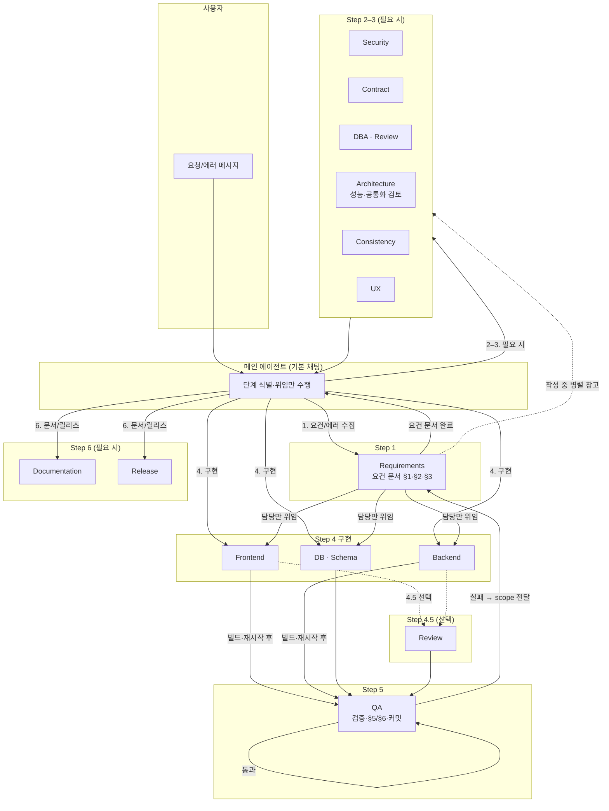

# 로그 관리 (logmng) — 개발 워크스페이스

로그 검색, 활동 이력, 통계, 승인·사용자 관리 등을 제공하는 프론트엔드·백엔드 프로젝트입니다.  
이 폴더(`dev`)는 **개발 전용 워크스페이스**이며, Cursor 규칙·커맨드·서브에이전트가 여기서 동작합니다.

---

## 📂 구조

```
dev/
├── frontend/          # React (포트 3001)
├── backend/           # Spring Boot (포트 9200)
├── docs/              # 개발 관련 문서만 (요건·계약·워크플로우·템플릿)
│   ├── contract.md    # API·DB·포트 계약
│   ├── QUICK_START.md # 빠른 시작
│   ├── workflow/      # 워크플로우·위임 표(실행 시 참조)
│   ├── template/      # 요건·버그픽스 템플릿
│   ├── requirements/  # 요건 문서 (yyyyMMdd-이름.md)
│   └── design/        # UX 설계 표준
├── scripts/           # 서비스 기동/중지 (dev-services.sh)
└── .cursor/           # 규칙·커맨드·스킬·에이전트
    └── delegation-mgmt/   # 서브에이전트 개선·위임 관리 문서(개발 문서와 분리)
```

---

## ⚙️ 초기 환경 구성 (최초 1회)

Cursor에서 **브라우저 자동화 검증**(`/verify` 시 프론트 변경 TC 실행)을 쓰려면 아래를 설정하세요.

### 1. Cursor Settings에서 Browser automation 활성화

- **Cursor** → **Settings** → **Features** (또는 **MCP**)에서 **Browser automation** 사용 설정을 켭니다.
- MCP 서버 목록에 브라우저 관련 서버가 켜져 있는지 확인하세요.

### 2. Puppeteer MCP — `.cursor/mcp.json` 활성화

프로젝트에 이미 `.cursor/mcp.json`이 있으며, Puppeteer MCP 서버가 정의되어 있습니다.

```json
{"mcpServers":{"browser":{"command":"npx","args":["-y","@modelcontextprotocol/server-puppeteer"]}}}
```

- Cursor가 이 워크스페이스(`dev`)를 열었을 때 위 설정을 읽어 **browser** 서버를 띄웁니다.
- 최초 실행 시 `npx -y @modelcontextprotocol/server-puppeteer`로 인해 Chromium이 자동 설치될 수 있습니다.
- **활성화 확인**: Cursor 채팅에서 브라우저 MCP 도구(browser_navigate, browser_snapshot 등)를 사용할 수 있으면 정상입니다.

상세 정책: [docs/workflow/BROWSER-AUTOMATION-VERIFICATION-POLICY.md](docs/workflow/BROWSER-AUTOMATION-VERIFICATION-POLICY.md)

---

## 🚀 빠른 시작

- **문서**: [docs/QUICK_START.md](docs/QUICK_START.md)
- **계약(API·포트)**: [docs/contract.md](docs/contract.md)  
  - 프론트엔드: http://localhost:3001  
  - 백엔드 API: http://localhost:9200/api  
  - DB: localhost:5432, DB `logmng`

```bash
# 서비스 재시작 (프로젝트 루트에서)
./scripts/dev-services.sh frontend restart   # 또는 backend | all
```

---

## 📋 Cursor로 작업할 때

**1단계 — 워크플로우 먼저 파악**  
새 요건·버그 수정은 **요건 문서(§1·§2·§3) → 구현 → 검증·커밋** 순서를 따릅니다. 먼저 읽을 문서:
- [docs/workflow/WORKFLOW_CHECKLIST.md](docs/workflow/WORKFLOW_CHECKLIST.md) — 순서·게이트 (가장 먼저)
- [docs/workflow/DEVELOPMENT_WORKFLOW.md](docs/workflow/DEVELOPMENT_WORKFLOW.md) — 상세·예시

**2단계 — 요청하기**  
- **새 요건/기능**: `/new-requirement` 후 요구사항을 적어 주세요.
- **검증**: `/verify` — 재시작·헬스 체크·(프론트 변경 시) 브라우저 자동화 검증.
- **요청 문장이 막힐 때** → [Cursor 프롬프팅 가이드](docs/CURSOR-PROMPTING-GUIDE.md)에서 예시·서브에이전트 활용 참고.

### 주요 슬래시 커맨드

| 명령 | 설명 |
|------|------|
| `/new-requirement` | 새 요건 시작 — 요건 문서 작성 후 개발 |
| `/verify` | 검증(재시작·헬스·브라우저) 실행 |
| `/check-frontend-backend` | 프론트·백엔드 동작 확인 |

자세한 명령·스킬·서브에이전트: [docs/README.md](docs/README.md).

### 서브에이전트 위임 흐름

새 요건·버그 수정 시 **메인 에이전트**가 단계별로 서브에이전트를 호출하는 관계입니다. (사용자가 "코드만 여기서" 등 예외를 말하지 않으면 위임이 적용됩니다.)



- **실선(→)**: 메인 또는 해당 단계에서의 정해진 위임.
- **점선(-.->)**: 선택·병렬 참고(Requirements 작성 중 전문가 참고, Review 선택).
- **DB vs DBA**: **DB (Schema)** = 스키마·마이그레이션·설정 구현(코드 수정). **DBA (Review)** = 스키마/설계 검토만(코드 수정 없음). 명칭 구분 기준: [.cursor/TERMINOLOGY.md §2.6](.cursor/TERMINOLOGY.md).
- **Architecture**: 성능·확장성 검토에 더해, **요구사항에 frontend/backend 구현이 포함되면 공통화(commonization) 검토**를 수행해 §2에 반영합니다. 공통 전담 에이전트 도입 옵션은 [CURSOR-SUBAGENTS-DESIGN §5.1](docs/workflow/CURSOR-SUBAGENTS-DESIGN.md) 참고.
- **검증 실패 시**: QA → Requirements → 실패 범위(frontend|backend|db|…)에 따라 **해당 전문가만** 위임 → 수정 후 QA 재검증.

상세 표·mcp_task 매핑: [docs/workflow/SUBAGENT-DELEGATION.md](docs/workflow/SUBAGENT-DELEGATION.md)

위임 흐름을 **점진적으로 개선**할 때: [.cursor/delegation-mgmt/](.cursor/delegation-mgmt/) (DelegationManager 서브에이전트·분석·백로그 — 제품 agents/skills/rules/commands와 분리).

---

## 📚 문서

| 문서 | 설명 |
|------|------|
| [docs/workflow/WORKFLOW_CHECKLIST.md](docs/workflow/WORKFLOW_CHECKLIST.md) | **워크플로우 순서·게이트** (먼저 읽기) |
| [docs/workflow/DEVELOPMENT_WORKFLOW.md](docs/workflow/DEVELOPMENT_WORKFLOW.md) | 개발 워크플로우 상세·예시 |
| [docs/workflow/SUBAGENT-DELEGATION.md](docs/workflow/SUBAGENT-DELEGATION.md) | 서브에이전트 위임 표 |
| [docs/workflow/CURSOR-SUBAGENTS-DESIGN.md](docs/workflow/CURSOR-SUBAGENTS-DESIGN.md) | 서브에이전트 역할·경계·공통화 검토·Common 에이전트 옵션(§5.1) |
| [docs/README.md](docs/README.md) | 개발 문서 구조·요건 요청 방법·Cursor 명령 정리 |
| [docs/QUICK_START.md](docs/QUICK_START.md) | 개발 환경·실행·검증 |
| [docs/contract.md](docs/contract.md) | API·DB·포트 계약 |
| [docs/CURSOR-PROMPTING-GUIDE.md](docs/CURSOR-PROMPTING-GUIDE.md) | Cursor 프롬프팅 가이드 — 요청 예시·서브에이전트 (필요 시 참고) |
| [.cursor/TERMINOLOGY.md](.cursor/TERMINOLOGY.md) | **.cursor 명칭·구분** — Rule / Command / Skill / Agent 정의 및 네이밍 규칙 (혼선 방지) |
| [.cursor/delegation-mgmt/](.cursor/delegation-mgmt/) | **위임 관리** — DelegationManager, 부작용·대응 분석, 점진적 개선 백로그 (제품 에이전트와 분리) |

---

## 🔄 최근 변경 (2025-03-04)

### 워크플로우·도구 변경

- **테스트 코드 구현 필수화 (Step 4)**: 구현 단계(Backend/Frontend)에서 §3 테스트 케이스에 대한 자동화 테스트 코드를 **반드시 작성**해야 합니다. (`mvn test` / `npm test`로 실행 가능). 기존에는 테스트 실행만 요구했으나, 이제 테스트 코드 작성까지 구현 에이전트의 책임입니다.
- **요건 템플릿 Definition of Done 추가**: `docs/template/REQUIREMENT_TEMPLATE.md` §3에 "Mandatory automated tests" 절이 추가되어, 수정·추가된 모든 코드에 자동화 테스트가 필요함을 명시합니다.
- **WORKFLOW_CHECKLIST Step 5 업데이트**: 단위/통합 테스트 **구현** + 실행으로 변경.
- **에이전트 위임 규칙 명확화**: `agent-collaboration.mdc`에서 테스트 코드 작성이 Step 4(Backend/Frontend 서브에이전트) 소관임을 명시. 메인 채팅에서 직접 테스트 코드를 작성하지 않습니다.

### 새로운 Skills

- **api-permission-map**: API 엔드포인트별 권한 검증 맵 — 모든 API → 컨트롤러 → 권한 체크 메서드 → 거부 시 에러 코드. 권한 검증 테스트 계획, 403 에러 매핑 작업 시 사용.
- **db-domain**: PostgreSQL 스키마, 마이그레이션, 설정 스크립트. DB 스키마 설계·마이그레이션·setup.sh 관련 질문 시 사용.
- **test-workflow**: 테스트·검증 워크플로우 — §3 테스트 계획, 단위/통합 실행, §5 기록, 검증(재시작·헬스 체크).
- **react-debugging**: React 디버깅 가이드.

### 주요 요건 문서 추가 (2025-03-03 ~ 03-04)

- 권한 그룹 모달 에러 표시 (`20260304-permission-group-modal-error-visibility`)
- 권한 스코프 팀 및 승인 대기 (`20250304-permission-scope-team-and-approval-pending`)
- 권한 그룹 기능 검증 (`20250304-permission-group-function-verification`)
- 사용자당 단일 권한 그룹 (`20250304-single-permission-group-per-user`)
- 화면별 기능 사용 가능 여부 (`20250303-screen-function-availability`)

---

**마지막 업데이트**: 2025-03-04
