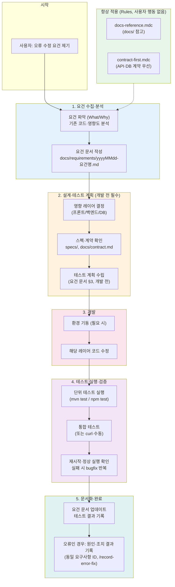
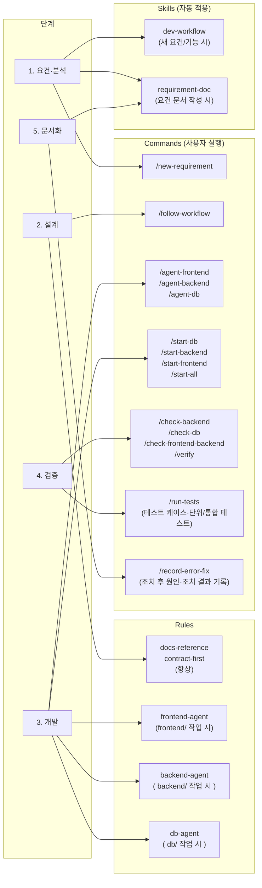
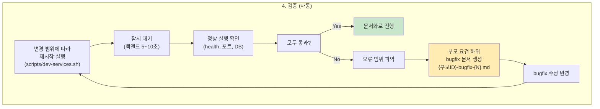
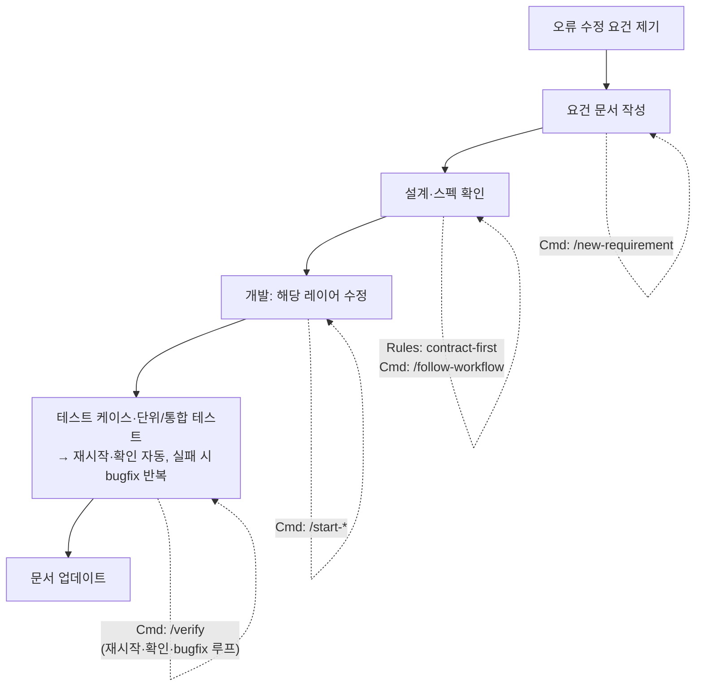

# 오류 수정 요건 → 작업 진행 흐름 (Flowchart)

사용자가 **오류 수정 요건**을 제기했을 때, Skills / Sub-Agent / Commands 가 어느 시점에 어떻게 쓰이는지 정리한 흐름도입니다.

---

## 전체 흐름도 (Mermaid)

---

## 시점별: Skills / Sub-Agent / Commands 사용

---

## 단계별 상세: 무엇을 언제 쓸지

| 단계 | 진행 내용 | Rules (자동) | Skills (자동) | Commands (선택·수동) |
|------|-----------|--------------|----------------|----------------------|
| **1. 요건 수집·분석** | 요건 파악, 요건 문서 작성 | docs-reference, contract-first | dev-workflow, requirement-doc | `/new-requirement` — 새 요건 시작 시 한 번에 지시 |
| **2. 설계·테스트 계획** | 영향 레이어 결정, 스펙·계약 확인. **개발 전에** 요건 문서 §3 **테스트 계획(테스트 케이스 목록)** 수립. 개발 후에 요구사항·테스트 계획 기록 금지 | 동일 | — | `/follow-workflow` — 워크플로우 단계 점검 |
| **3. 개발** | 환경 기동, 해당 레이어 코드 수정. (1·2 완료 후에만 착수) | frontend-agent / backend-agent / db-agent (해당 경로 열면 자동) | — | `/agent-frontend`·`/agent-backend`·`/agent-db` — 역할 고정 `/start-db`·`/start-backend`·`/start-frontend`·`/start-all` — 서비스 기동 |
| **4. 테스트 실행·검증** | **단위 테스트**(mvn test / npm test) → **통합 테스트**(또는 curl·수동) → 재시작·정상 실행 확인·bugfix 반복. (테스트 계획은 2단계에서 이미 §3에 작성됨) | — | dev-workflow | `/run-tests` — 단위/통합 테스트 실행 `/verify` — 재시작·확인·bugfix 반복 `/check-*` — 개별 상태 확인 |
| **5. 문서화** | 요건 문서에 테스트 결과 반영; **오류인 경우** 원인·조치 결과를 **동일 요구사항 ID**로 같은 문서에 기록 | docs-reference | requirement-doc | `/record-error-fix` — 조치 완료 후 원인·조치 결과 기록 |

---

## 검증 단계: 재시작·정상 실행 확인·bugfix 반복

사용자에게 "재시작해 주세요"라고 하지 않는다. 에이전트가 아래를 **자동**으로 수행한다.

- **재시작**: `./scripts/dev-services.sh frontend|backend|db|all restart`
- **확인**: 백엔드 `GET /api/health`, 프론트 포트 3001, DB 사용 시 `GET /api/db/test`
- **실패 시**: `docs/requirements/{부모요건ID}-bugfix-{N}.md` 생성 (템플릿: `docs/template/BUGFIX_CHILD_TEMPLATE.md`) → 수정 후 다시 재시작·확인

---

## 요약 다이어그램 (단순 버전)

---

- **Rules**: 대화/파일 경로에 따라 자동 적용. 사용자가 매번 명령할 필요 없음.
- **Skills**: “요건”, “요건 문서” 등 트리거 시 자동 적용.
- **Commands**: 사용자가 슬래시로 선택해 실행. 빠르게 단계·역할·검증을 고정할 때 사용.

이 파일은 `docs/workflow/` 에 있으며, 워크플로우 가이드와 함께 참고하면 됩니다.
